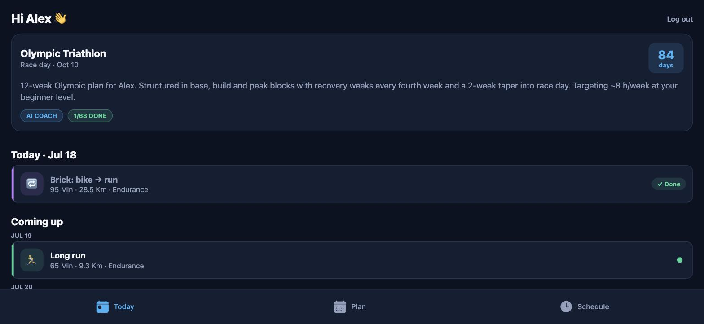
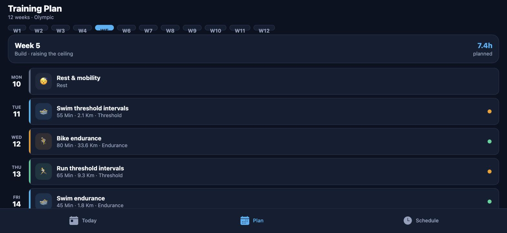

# TriCoach — AI‑powered triathlon coaching

A production‑shaped MVP that generates **periodised triathlon training plans**
(Sprint · Olympic · Half Ironman · Ironman), gives **concise post‑workout AI
feedback**, sends **push notifications**, and schedules training **around a busy
calendar**.

A **Rust backend** (Axum + SQLx + PostgreSQL) paired with a **React Native**
(Expo + TypeScript) app. The work began by auditing an existing coaching
prototype, proposing a scalable rebuild, and implementing the core features
cleanly.

<p align="center">
  
  
</p>

---

## Why this design proves the point

The headline feature — plan generation — is split deliberately:

| Concern | Owner | Why |
| --- | --- | --- |
| **Workout scheduling & timing** (which day, how long, what intensity) | A pure, deterministic **periodisation engine** in Rust | Timing must always be correct — the brief explicitly called out *"incorrect day or workout timing"*. Pure functions are unit‑testable and can't regress. |
| **Coaching voice** (plan summary, workout feedback) | **Google Gemini**, behind an `AiCoach` trait | This is where an LLM shines. Prompts cap length to fix *"overly long responses"*. |
| **Resilience** | Gemini failures **fall back** to a rule‑based engine | The API never fails just because the LLM did, and the whole app runs with **no API key at all**. |

So the app is fully runnable offline (deterministic coach), and *upgrades* to
real AI when `GEMINI_API_KEY` is set — the same trait, two implementations.

```
            ┌───────────────────────── Rust backend (Axum) ─────────────────────────┐
            │  routes → services → repositories → PostgreSQL                          │
 RN app ──► │                              │                                          │
 (Expo)     │                              ▼                                          │
            │                        AiCoach (trait)                                  │
            │              ┌───────────────┴───────────────┐                          │
            │        GeminiCoach                      RuleBasedCoach                   │
            │     (LLM voice + fallback)     (deterministic periodisation engine)      │
            └───────────────────────────────────────────────────────────────────────┘
```

---

## Tech stack

**Backend** — Rust · [Axum](https://github.com/tokio-rs/axum) · [SQLx](https://github.com/launchbadge/sqlx) + **PostgreSQL** · JWT (`jsonwebtoken`) + Argon2id password hashing · `tracing` · Google Gemini · Expo Push.

**Mobile** — React Native (Expo SDK 57, TypeScript) · React Navigation · TanStack Query · Axios · SecureStore.

**Ops** — Multi‑stage Docker build · deployed on `internal-one` (systemd + nginx + PostgreSQL) at **https://coaching-app.getprixite.com**.

> There is a single deployed environment on `internal-one` — the app is built and
> tested there, backed by one PostgreSQL database (`coaching-app`). The data layer
> is isolated behind repository functions, so the database stays a contained concern.

---

## Repository layout

```
backend/           Rust API (Axum + SQLx)
  src/
    ai/            AiCoach trait, Gemini client, deterministic periodization engine (+ tests)
    auth/          JWT issuing/verifying, Argon2 hashing, extractor middleware
    domain/        Entities, DTOs, TEXT‑backed enums
    repositories/  One module per table (data access)
    routes/        Axum routers (auth, profile, plans, workouts, schedule, devices)
    services/      Business logic orchestrating repos + AI
    notifications/ Expo push sender
  migrations/      SQL schema
mobile/            Expo React Native app (TypeScript)
  src/
    api/           Typed API client + endpoint functions
    components/    Reusable UI (Button, Card, WorkoutCard, …)
    screens/       Login, Register, Onboarding, Today, Plan, WorkoutDetail, Schedule
    navigation/    Auth stack ↔ app tabs
    state/         Auth context + secure token storage
docs/              Audit, development plan, deployment guide
docker-compose.yml
```

---

## Environment & deployment

The app runs on the **`internal-one`** server — there is no separate local backend.

**Live API:** https://coaching-app.getprixite.com · health: `/health`

| Piece | Detail |
| --- | --- |
| Runtime | systemd service `coaching-app` (system user `coaching-app`), native binary at `/opt/coaching-app/bin/tricoach` on `127.0.0.1:3010`, behind nginx + TLS |
| Database | one PostgreSQL database, `coaching-app`, on the same host |
| Config | `/etc/coaching-app/coaching-app.env` (not in the repo); set `GEMINI_API_KEY` there to use Gemini instead of the deterministic coach, then `systemctl restart coaching-app` |

### Deploy / redeploy

The server holds a checkout at `/opt/coaching-app/src` plus a deploy script. To ship `main`:

```bash
git push origin main
ssh internal-one /opt/coaching-app/deploy.sh   # pull → docker build → extract → restart
```

The script builds the release binary with Docker (no Rust toolchain on the host) and
restarts the service; migrations run automatically on startup.

### Mobile client

The Expo app points at the live API (`app.json → extra.apiUrl`):

```bash
cd mobile
npm install
npm run web        # or: npm run ios / npm run android
```

### Tests

The deterministic periodization engine is fully unit‑tested (`cargo test` in `backend/`);
tests also run inside the Docker build.

---

## API overview

All routes are under `/api/v1`. Protected routes require `Authorization: Bearer <jwt>`.

| Method | Path | Description |
| --- | --- | --- |
| `POST` | `/auth/register` | Create account, returns JWT |
| `POST` | `/auth/login` | Log in, returns JWT |
| `PUT` | `/profile` | Create/update athlete profile |
| `GET` | `/profile` | Get athlete profile |
| `POST` | `/plans` | Generate a training plan (deterministic schedule + AI summary) |
| `GET` | `/plans/active` | Active plan **with** all workouts |
| `GET` | `/plans` | List all plans |
| `GET` | `/plans/:id` | A plan with workouts |
| `POST` | `/workouts/:id/feedback` | Log a workout → returns concise AI feedback |
| `GET` | `/workouts/:id/feedback` | Fetch saved feedback |
| `PATCH` | `/workouts/:id/status` | Mark completed / skipped |
| `GET` | `/schedule?from=&to=` | Workouts + busy calendar blocks in a window |
| `POST` | `/schedule/blocks` | Add a busy block |
| `DELETE` | `/schedule/blocks/:id` | Remove a busy block |
| `POST` | `/devices` | Register an Expo push token |

<details>
<summary>Example: generate a plan (curl)</summary>

```bash
BASE=https://coaching-app.getprixite.com
TOKEN=$(curl -s -X POST $BASE/api/v1/auth/register \
  -H 'Content-Type: application/json' \
  -d '{"email":"alex@example.com","password":"password123"}' | jq -r .token)

curl -s -X PUT $BASE/api/v1/profile -H "Authorization: Bearer $TOKEN" \
  -H 'Content-Type: application/json' \
  -d '{"display_name":"Alex","age":34,"weight_kg":72.5,"experience_level":"beginner","weekly_hours_available":8,"resting_hr":52,"max_hr":186}'

curl -s -X POST $BASE/api/v1/plans -H "Authorization: Bearer $TOKEN" \
  -H 'Content-Type: application/json' \
  -d '{"race_distance":"olympic","race_date":"2026-10-11"}' | jq
```
</details>

---

## Engineering notes

- **Layered architecture** — `routes → services → repositories`. Handlers are thin;
  business rules live in services; SQL is confined to repositories.
- **Type‑safe enums over TEXT** — a `string_enum!` macro derives serde,
  `Display`/`FromStr`, and SQLx `Type/Encode/Decode` so domain enums map cleanly to
  `TEXT` columns without stringly‑typed code.
- **Ownership enforced in SQL** — e.g. a workout is only returned if it joins to a
  plan owned by the authenticated user, so authorisation can't be forgotten in a handler.
- **Errors as one type** — `AppError` implements `IntoResponse`; internal errors are
  logged server‑side but never leak details to clients.
- **Deterministic, tested core** — periodisation (base → build → peak → taper, recovery
  weeks, rest days) is pure and covered by unit tests.

See [`docs/AUDIT.md`](docs/AUDIT.md) for the prototype audit and
[`docs/DEVELOPMENT_PLAN.md`](docs/DEVELOPMENT_PLAN.md) for milestones.

---

## Status

Backend builds clean, unit tests pass, and every endpoint has been exercised
end‑to‑end. The mobile app runs the full journey — register → onboarding →
plan generation → workout logging with AI feedback → schedule — verified in the
browser with no console errors.
